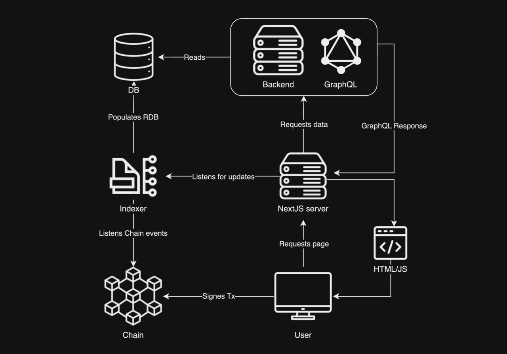

#  Archisinal Marketplace

## Introduction

Welcome to the Archisinal Marketplace App repository. This app is a comprehensive solution for the Archisinal NFT
Marketplace, designed specifically for professionals in the Architecture, Engineering, and Construction (AEC)
industries. The repository includes the frontend, backend, and indexer components of the app.

## Repository Structure
`packages/client`: The user interface of the marketplace, built with NextJS.

`packages/db`: A PostgreSQL database that stores data for the indexer and backend components.

`packages/backend`: A GraphQL server layer that fetches data from the PostgreSQL database for the frontend.

`packages/indexer`: Listens to blockchain events and populates data into the PostgreSQL database.

## Architecture

## Deployment and Access
**Marketplace Contracts**: Deployed on the Shibuya testnet. Check the [DEPLOYMENTS.md](https://github.com/Archisinal/marketplace-contracts/blob/main/DEPLOYMENTS.md) file for contract addresses.

**Client Access**: The client can be accessed at https://marketplace-app-client.vercel.app/.

## Wallet Support
The marketplace supports three types of wallets for user transactions and interactions:

1. SubWallet
2. Talisman
3. PolkadotJs

These wallets facilitate seamless integration with the marketplace, ensuring secure and efficient transactions.

## Access from mobile devices
The marketplace is fully responsive and accessible on mobile devices though web interface: https://marketplace-app-client.vercel.app/

> Currently only the SubWallet is supporting mobile browser. It's available for [iOS](https://apps.apple.com/us/app/subwallet-polkadot-wallet/id1633050285) and [Android](https://play.google.com/store/apps/details?id=app.subwallet.mobile&hl=en&gl=US) platforms

## Testing guide

Detailed testing guide can be found [here](./TESTING.md)