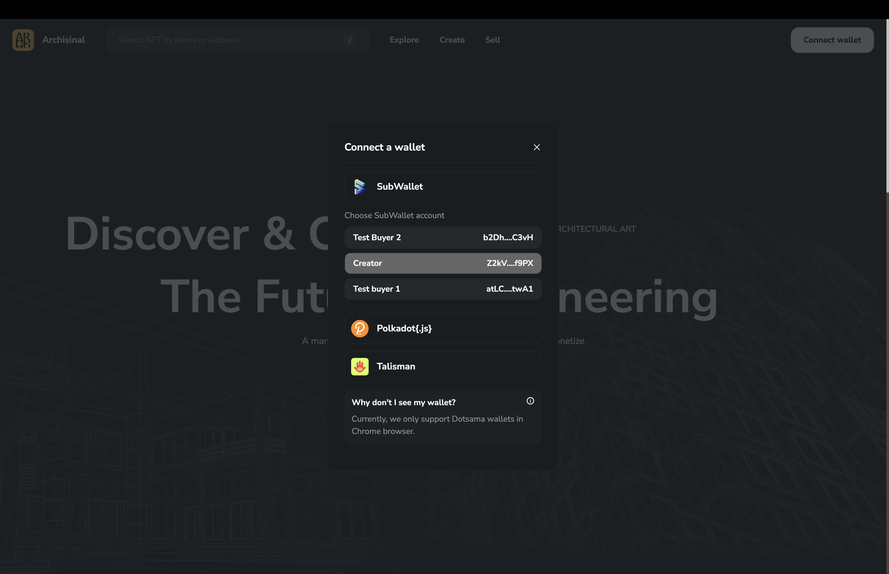
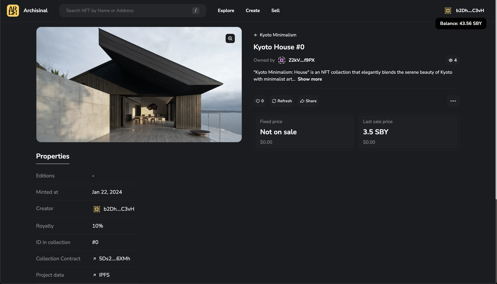
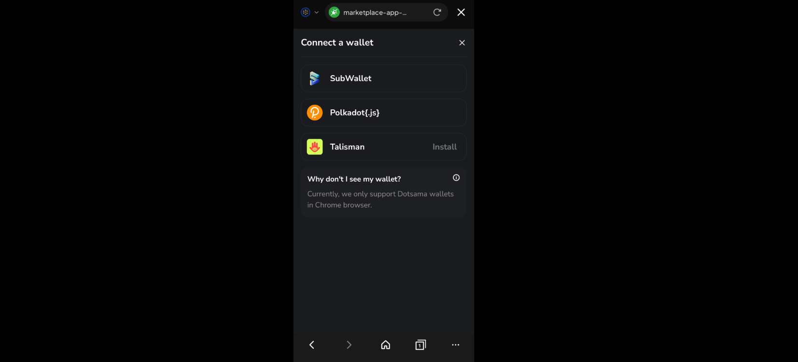
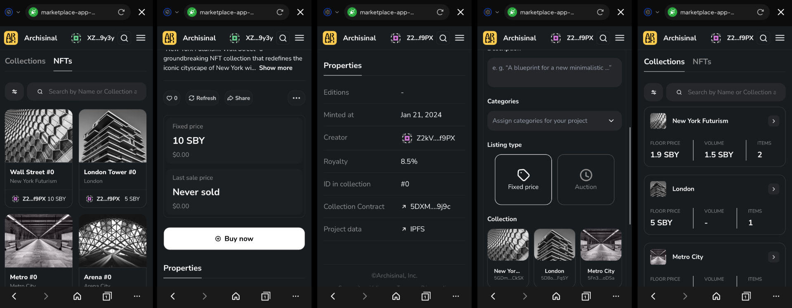

# Testing Guide for Archisinal Marketplace MVP

This guide covers all the basic functionalities of the Archisinal Marketplace MVP. It is divided into sections, each focusing on a specific feature.

## Table of Contents

- [Connect Wallet](#connect-wallet)
- [Create Collection and Mint NFT](#create-collection-and-mint-nft)
- [List NFT for Sale and Cancel Listing](#list-nft-for-sale-and-cancel-listing)
- [Buy NFT](#buy-nft)
- [Secondary Sale Royalties](#secondary-sale-royalties)
- [Mobile Testing](#mobile-testing)

## Connect Wallet

1. Open [Archisinal Marketplace](https://marketplace-app-client.vercel.app/).
2. Click the `Connect Wallet` button in the top right corner. If the extension is not installed, click the `Install` link in the popup window.

   

   > Note: Archisinal Marketplace supports three Dotsama wallets: SubWallet, Talisman, and PolkadotJS. Currently, only SubWallet offers a mobile browser option.

3. Choose a wallet and select an account. If you have only one account, it will be selected automatically.

   

4. After connecting your wallet, your address will appear in the top right corner. Hover over the address to view your balance. Your balance is also visible in the wallet popup.

   
   

## Create Collection and Mint NFT

1. Open [Archisinal Marketplace](https://marketplace-app-client.vercel.app/) and click the `Create` link in the header.

   > The UI will prompt you to connect your wallet if you haven't done so already.

2. Click the `Create +` button in the `Collection` section and fill in the form.

   

3. Approve the transaction in the wallet popup and wait for it to be confirmed. You will then see your collection in the list.

   

   > Note: You should have enough SBY tokens to cover the transaction fee.
   > Sometimes, you may need to refresh the page to see the collection in the list.

4. Fill in the form for NFT creation. Choose a collection, name, description, category, and set the royalty for secondary sales. Upload an NFT image and a project filter in a ZIP archive.

   

5. Approve the transaction in the wallet popup and wait for it to be confirmed. Your NFT will then appear on the Sell page.

   

## List NFT for Sale and Cancel Listing

1. Open [Archisinal Marketplace](https://marketplace-app-client.vercel.app/) and click the `Sell` link in the header.
2. Select an NFT from the list and click on it.
3. On the NFT details page, you can view all details of the NFT, including views, last sale price, and current price. Clicking the `Collection Contract` link will open the contract page on [Subscan](https://shibuya.subscan.io/), depending on the chain.

   

4. Enter a price for listing (e.g., "3.5") and click the `Put on sale` button. You need to sign two transactions: the first to approve the marketplace to use your NFT and the second to list the NFT.

   > The page will automatically refresh after the transaction is confirmed, but you can also manually refresh it by clicking the `Refresh` button.

5. After listing, your NFT will appear on the sale page. Note that the owner of the NFT is now the Archisinal marketplace contract. You can click the link to check the contract on [Subscan](https://shibuya.subscan.io/).

   

6. You can cancel the listing by clicking the `Cancel Listing` button.

## Buy NFT

1. Open [Archisinal Marketplace](https://marketplace-app-client.vercel.app/) and click the `Explore` link in the header. Select a wallet different from the NFT owner's to use for buying the NFT.
2. Select the Collection from which you want to buy an NFT.

   

3. Select an NFT from the list and click on it.

   

4. Click the `Buy` button and sign the transaction in the wallet popup.
5. You are now the owner of the NFT and can list it for sale.

   

## Secondary Sale Royalties

1. Open [Archisinal Marketplace](https://marketplace-app-client.vercel.app/) and click the `Sell` link in the header. Select an NFT you did not create.
2. Set a price and list the NFT for sale. Note that 10% of the price, which is the collection royalty, will be sent to the NFT's creator as a royalty.

   

3. Buy this NFT from another wallet. Then, check the wallet of the NFT creator to see that 10% of the sale price was sent to the creator as a royalty.

   
   

## Mobile Testing

Currently, Archisinal Marketplace supports mobile devices only via SubWallet. Install SubWallet on your mobile device to use it as a browser.

Available for [iOS](https://apps.apple.com/us/app/subwallet-polkadot-wallet/id1633050285) and [Android](https://play.google.com/store/apps/details?id=app.subwallet.mobile&hl=en&gl=US) platforms.

1. Open SubWallet and click the `Browser` button in the bottom menu.
2. Navigate to [Archisinal Marketplace](https://marketplace-app-client.vercel.app/) and click the `Connect Wallet` button in the top right corner.
3. Choose `SubWallet` and select an account. If you have only one account, it will be selected automatically.

   

4. Now, you can use Archisinal Marketplace as a regular web app. You can create collections, mint NFTs, list them for sale, and buy NFTs.

   
   
   
   
   
