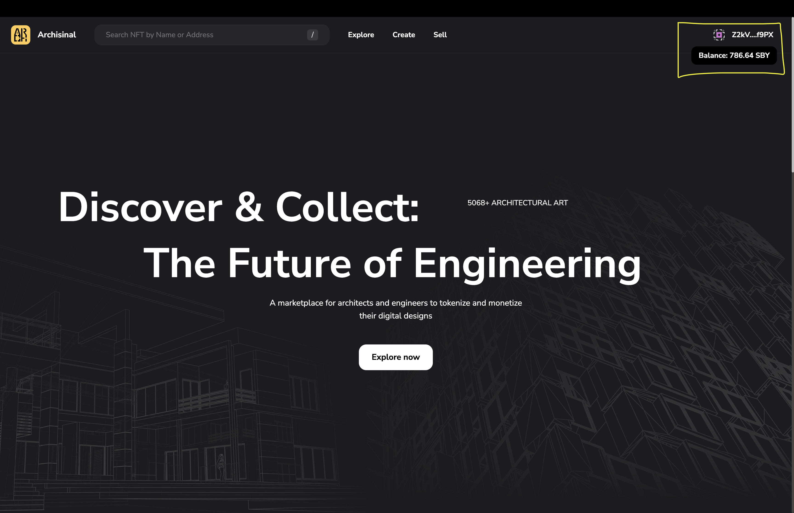

# Testing guide

The guide covers all basic functionality of Archisinal Marketplace MVP. It is divided into sections, each section covers a specific functionality.

## Table of Contents

- [Connect Wallet](#connect-wallet)
- [Create Collection and mint NFT](#create-collection-and-mint-nft)
- [List NFT on sale and Cancel listing](#list-nft-on-sale-and-cancel-listing)
- [Buy NFT](#buy-nft)
- [Secondary sale royalties](#secondary-sale-royalties)
- [Mobile testing](#mobile-testing)

## Connect Wallet

1. Open [Archisinal Marketplace](https://marketplace-app-client.vercel.app/)
2. Press `Connect Wallet` button in the top right corner. Click `Install` link in the popup window, if extension is not installed.

> Note: Archisinal Marketplace supports three Dotsama wallets: SubWallet, Talisman, and PolkadotJS. Only SubWallet currently features a mobile browser option.

3. Choose wallet and select account. If you have only one account, it will be selected automatically.

4. After connecting wallet, you will see your address in the top right corner. Hovering the address will show your balance. Also, you can see your balance in the wallet popup.

 

## Create Collection and mint NFT

1. Open [Archisinal Marketplace](https://marketplace-app-client.vercel.app/) and click `Create` link in the header.

> UI will prompt you to connect wallet, if you haven't done it yet.

2. Click `Create +` button in `Collection` section. and fill in the form.

3. Approve transaction in the wallet popup and wait for the transaction to be confirmed. After that, you will see your collection in the list.

> Note: You should have enough SBY tokens to pay for transaction fee.
> Sometimes you need to refresh the page to see the collection in the list.

4. Fill in the form for NFT creation. You can choose collection, name, description, category, and royalty for secondary sales. Upload NFT image and project filter in ZIP archive.

5. Approve transaction in the wallet popup and wait for the transaction to be confirmed. After that, you will see your NFT on Sell page.

## List NFT on sale and Cancel listing

1. Open [Archisinal Marketplace](https://marketplace-app-client.vercel.app/) and click `Sell` link in the header.
2. Select NFT from the list and click on it. 
3. You will land on NFT details page. Here you can all NFT details, views, last sale price and current price. Clicking `Collection Contract` link will open contract page on [Subscan](https://shibuya.subscan.io/) depending on chain.

4. Fill in price for listing, e.g. "3,5" and click `Put on sale` button. You have to sign 2 transactions: 1st to approve marketplace for using you NFT and 2nd to list NFT.
> The page will be refreshed automatically after transaction is confirmed, but you can also refresh it manually clicking `Refresh` button.

5. After listing, you will see your NFT on sale page. Note that the owner of the NFT is Archisinal marketplace contract. You can click the link and check the contract on [Subscan](https://shibuya.subscan.io/).

6. You can cancel listing by clicking `Cancel Listing` button.

## Buy NFT

1. Open [Archisinal Marketplace](https://marketplace-app-client.vercel.app/) and click `Explore` link in the header. Select the Wallet you want to use for buying NFT (it should differ from the owner of the NFT).
2. Select the Collection you want to buy NFT from.

3. Select NFT from the list and click on it.

4. Click `Buy` button and sign transaction in the wallet popup.
5. Now you are the owner of the NFT and can list it on sale.

## Secondary sale royalties

1. Open [Archisinal Marketplace](https://marketplace-app-client.vercel.app/) and click `Sell` link in the header. Select the NFT, which you didn't create.
2. Choose the price and list NFT on sale. Note that 10% of the price (which is the collection royalty) will be sent to the creator of the NFT as a royalty.

3. Try to Buy this NFT from another wallet. Then select the wallet of NFT Creator and check that 10% of the NFT sale price was sent to Creator as a royalty.

## Mobile testing

Curretly, Archisinal Marketplace supports mobile devices only via SubWallet. You can install SubWallet on your mobile device and use it as a browser.

It's available for [iOS](https://apps.apple.com/us/app/subwallet-polkadot-wallet/id1633050285) and [Android](https://play.google.com/store/apps/details?id=app.subwallet.mobile&hl=en&gl=US) platforms

1. Open SubWallet and click `Browser` button in the bottom menu.
2. Navigate to [Archisinal Marketplace](https://marketplace-app-client.vercel.app/) and click `Connect Wallet` button in the top right corner.
3. Choose `SubWallet` and select account. If you have only one account, it will be selected automatically.

4. Now you can use Archisinal Marketplace as a regular web app. You can create collections, mint NFTs, list them on sale, and buy NFTs.

